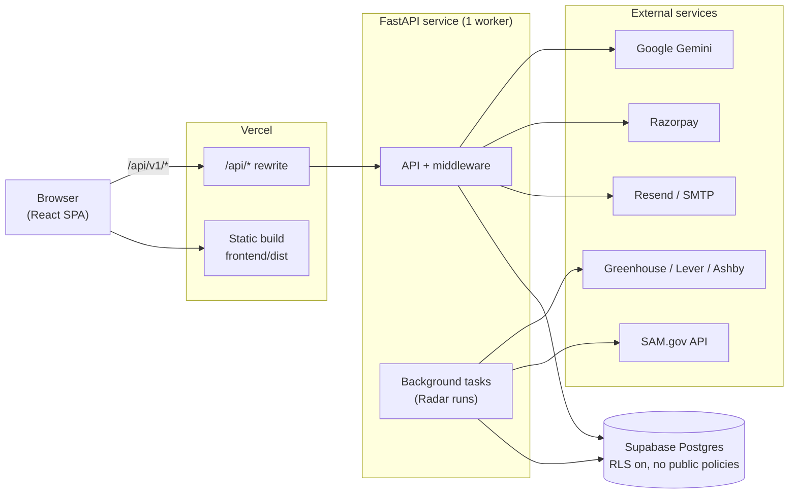
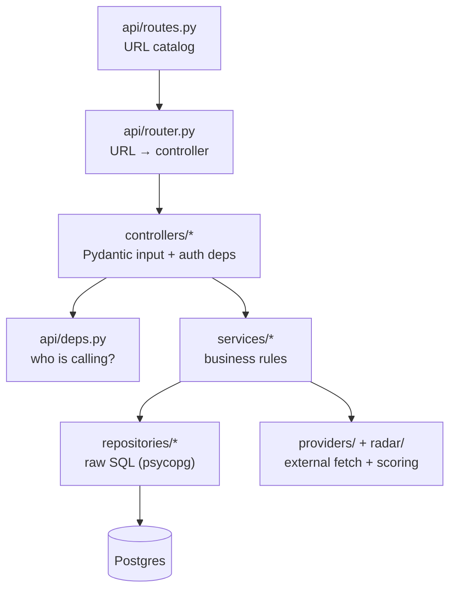
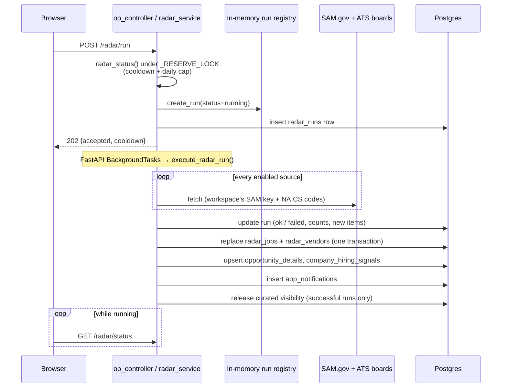

# OpportunityPedia — Architecture

This document describes how the system is put together: the components, how they talk to each
other, where state lives, and the constraints that shape the design.

For step-by-step setup, the full environment variable table, and the full route list, see
[`README.md`](README.md). For database setup, see [`supabase/SETUP.md`](supabase/SETUP.md).

---

## 1. System overview

OpportunityPedia is a single-page React app backed by one FastAPI service and one Postgres
database. **OpportunityX** is the company (OpportunityX Private Limited), and the public website
belongs to it. **OpportunityPedia** is a product of OpportunityX: an opportunity-intelligence
dashboard that scans public job boards and SAM.gov, scores what it finds, and lets a team assign
leads and send outreach. The public website is described in
[section 3.5](#35-public-website).



Three rules hold across the whole codebase:

1. **The browser never talks to the database.** There is no Supabase JS client. Every read and
   write goes through the FastAPI API, which is the only holder of `DATABASE_URL`.
2. **SQL lives only in `backend/app/repositories/`.** Business rules live in `services/`.
   Controllers only validate input and resolve the caller.
3. **One backend worker.** Several pieces of state live in process memory (see
   [section 8](#8-in-process-state-and-the-single-worker-constraint)), so the API must run as a
   single Uvicorn worker.

---

## 2. Repository layout

| Path | What it holds |
|---|---|
| `frontend/` | React 19 + Vite + TypeScript SPA (marketing site, product app, admin console) |
| `backend/app/` | FastAPI application |
| `backend/seed_accounts.py` | Upserts the platform admin and demo customer from `.env` |
| `supabase/schema.sql` | Canonical schema for a fresh database |
| `supabase/migrations/` | Ordered, tracked schema changes (10 files as of 2026-09-21) |
| `render.yaml`, `backend/Dockerfile`, `frontend/vercel.json` | Deployment definitions |

---

## 3. Frontend architecture

### 3.1 One router, four zones

`frontend/src/routes/router.tsx` defines a single browser router with four independent zones.
Each zone is lazy-loaded, so marketing visitors never download product code. The one exception
is the marketing home page (`/`), which is bundled eagerly so the landing page renders without
waiting for a second chunk.

| Zone | Paths | Guard | Root component |
|---|---|---|---|
| Marketing | `/`, `/products`, `/products/opportunitypedia`, `/company`, `/careers`, `/contact`, `/privacy`, `/terms` (redirects and 404 in [3.5](#35-public-website)) | none | `SiteLayout` |
| Customer auth | `/login`, `/set-password`, `/workspace-setup`, `/get-started` | none | page components |
| Product app | `/app/overview`, `/app/opportunities`, `/app/vendors`, `/app/my-assignments`, `/app/activity`, `/app/settings` | `RequireUserAuth` | `AppProviders` → `AppShell` |
| Admin console | `/admin/leads`, `/admin/opportunities`, `/admin/users` (login at `/admin/login`) | `RequireAdminAuth` | `AdminApp` |

Opportunity details open as nested routes (`/app/opportunities/:id`, `/app/vendors/:id`) that
render a drawer over the list, so a detail view is deep-linkable.

### 3.2 Provider stack for the product app

`frontend/src/app/AppProviders.tsx` wraps every `/app/*` page:

```text
RequireUserAuth                 redirect to /login if no customer token
 └─ QueryClientProvider         TanStack Query (staleTime 30s, retry 1, no refetch on focus)
     └─ CurrentUserProvider     wires the token into the API client, loads the team, sets permissions
         └─ TooltipProvider
             └─ AppShell        sidebar + topbar + <Outlet/> + footer
```

### 3.3 State

| Kind of state | Where it lives |
|---|---|
| Auth sessions | `store/useAuthStore.ts`, a Zustand store persisted to **sessionStorage** (`op-auth`). It holds a customer session and an admin session separately, so closing the browser ends both. |
| Server data | TanStack Query. Keys are centralized in `services/queryKeys.ts`. |
| UI state | `store/useUiStore.ts` (drawers, sidebar) and `store/useToastStore.ts` |

### 3.4 API client

`frontend/src/app/services/api.ts` is the only HTTP client: one Axios instance with base URL
`VITE_API_BASE_URL ?? '/api/v1'`.

- A request interceptor attaches `Authorization: Bearer <token>` from the auth store. Admin
  calls pass their own header explicitly, and the interceptor leaves those alone.
- A response interceptor maps errors to user-facing messages. Two cases change application
  state:
  - `401 "Signed in elsewhere…"` clears the matching session and redirects to login.
  - A `403` whose detail mentions an ended free trial clears the customer session.
- Each feature has its own service module (`opportunities.ts`, `radar.ts`, `outreach.ts`,
  `workspace.ts`, and so on) that calls this client.

The relative `/api/v1` base works the same way everywhere:

- **Local dev:** the Vite dev server proxies `/api` to `http://127.0.0.1:8000`
  (`frontend/vite.config.ts`).
- **Production:** Vercel rewrites `/api/*` to the backend host (`frontend/vercel.json`).

Because the browser always sees a same-origin `/api`, CORS rarely comes into play.

### 3.5 Public website

The marketing zone is the public website of **OpportunityX**, the company. It presents
OpportunityX and its products. **OpportunityPedia** is currently the only product, and the site
links into it at `/app/overview`. All public-site code lives in `frontend/src/marketing/`, apart
from the shared logo and product mark (`frontend/src/shared/brand/Logo.tsx`) and `RouteFallback`.

#### Public routes

Every route is a child of `SiteLayout` in `router.tsx`.

| Path | Page | Notes |
|---|---|---|
| `/` | `HomePage` | Bundled eagerly |
| `/products` | `ProductsPage` | All products, shown as an accordion (`ProductAccordion`) |
| `/products/opportunitypedia` | `OpportunityPediaPage` | Product page. "Open OpportunityPedia" goes to `/app/overview`, "Start free plan" goes to `/get-started` |
| `/company` | `CompanyPage` | |
| `/careers` | `CareersPage` | |
| `/contact` | `ContactPage` | Posts to the API through `marketing/lib/submitContactForm.ts` |
| `/privacy`, `/terms` | `PrivacyPage`, `TermsPage` | Rendered inside `LegalLayout`; `noindex` |
| `/about` | redirect | `<Navigate replace>` to `/company` |
| `/products/opportunityx` | redirect | `<Navigate replace>` to `/products/opportunitypedia` (the old product URL) |
| any other path | `NotFoundPage` (marketing) | `noindex`; rendered inside the site shell, so it has the same header and footer |

Pages other than Home are lazy-loaded through `marketing/pages/lazy.ts`. Each page sets its own
title, description, robots tag and canonical URL with `useSeo` (`index: false` produces
`noindex, follow`). `frontend/public/sitemap.xml` lists only the six indexable pages: `/`,
`/products`, `/products/opportunitypedia`, `/company`, `/careers` and `/contact`. It excludes the
`noindex` pages (`/privacy`, `/terms` and the 404) and the redirects. If a page's `index` setting
changes, update the sitemap to match.

#### Shared layout

`marketing/components/layout/SiteLayout.tsx` is the only shell for public pages:

```text
div.flex.min-h-svh.flex-col      shell: at least one small-viewport tall, column flex
 ├─ ScrollToTop
 ├─ Navbar                       sticky header, skip link to #main
 └─ Suspense (fallback: main#main.flex-1 > RouteFallback)
     ├─ main#main.flex-1         <Outlet/>, takes the remaining height
     └─ Footer
```

- The header, `main` and the footer are all in normal document flow. Only the header is sticky.
- Pages render content only. They never render their own header, footer or `<main>`.
- The Suspense boundary sits in the layout rather than around each route, and it wraps `main`
  and the footer together. While a lazy page chunk loads, only the fallback is shown, so the
  footer never appears briefly above the fold and then jumps down when the page arrives.

#### Footer architecture

- There is exactly one public footer: `marketing/components/layout/Footer.tsx`, rendered only by
  `SiteLayout`. The product app has its own separate footer (`app/components/layout/AppFooter.tsx`,
  inside `AppShell`), which never appears on public pages.
- The footer is a plain `<footer>` in normal flow. It is not fixed, absolute or sticky, and no
  JavaScript positions it. On short pages, the `min-h-svh` shell and the `flex-1` main keep it at
  the bottom of the viewport. On long pages, it follows the content.
- Its contents are, in order:
  - the logo and company description, and a "Company / Flagship product" index
  - three link columns from `footerNav` in `marketing/data/site.ts`:
    - **Company**: About, Careers, Contact
    - **Products**: All products, plus one link per product
    - **Legal**: Privacy, Terms
  - the legal identity block
  - the copyright line and tagline
- The footer grid's column count is tied to `footerNav`, so update both together.

#### Footer legal identity

The registered company details are defined once, in `legalEntity` in `marketing/data/site.ts`.
The footer and `LegalLayout` both render from it. Don't hard-code these details elsewhere, and
don't change them without the company's confirmation.

| Field | Value |
|---|---|
| Legal name | OpportunityX Private Limited |
| Registered address | Plot No. 901, Flat No. 302, Ayyappa Society, Madhapur, Shaikpet, Hyderabad – 500081, Telangana, India |
| CIN | U62011TS2026PTC221917 |
| Product attribution | "OpportunityPedia is a product of OpportunityX Private Limited." (built from the flagship product and `legalEntity`) |
| Copyright | `copyrightNotice`: "© 2026 OpportunityX Private Limited. All rights reserved." |

The legal entity is OpportunityX. OpportunityPedia is the product name, never a company name.

#### Navigation and product architecture

`marketing/data/products.ts` is the product registry and the source of truth for every product
surface. Each entry has a name, tagline, positioning line, summary, highlights, marketing `path`,
and optional `appUrl` and `signupUrl`. `flagshipProduct` is the entry marked `flagship`.
Highlights and capability copy describe customer value and must not name data sources.

| Surface | Reads from the registry |
|---|---|
| `site.ts` | Builds `primaryNav` (Products gets one child link per product), the `footerNav` Products column, and `site.productAppUrl` (the flagship's `appUrl`) |
| Desktop navbar (`Navbar.tsx`, `ProductsMenu.tsx`) | Products dropdown |
| Mobile menu (`MobileNavigation.tsx`) | Product links nested under Products |
| Products page (`ProductAccordion.tsx`) | One accordion row per product |
| Product page, home page sections, Company, legal pages | Flagship name, positioning and CTA URLs |

The desktop navigation, at `lg` widths and above:

- **Primary links:** Company, Products, Careers, Contact, plus a "Talk to us" button.
- **Products has two controls:**
  - The **Products** text link goes to `/products`.
  - A separate **chevron button** opens the dropdown. It has `aria-expanded` (plus
    `aria-controls` while open), and its label is "Show products" or "Hide products".
- **Opening the dropdown:** moving a mouse over Products opens it, and moving away closes it after
  a short delay. Touch and keyboard toggle it with the chevron. A mouse click on the chevron
  keeps it open rather than closing it.
- **Closing the dropdown:** Escape closes it. If focus was inside the Products item, focus
  returns to the chevron. It also closes when
  focus leaves the Products item, on a pointer press outside it, and on any route change.
- **The dropdown** (`ProductsMenu`) is a 20rem panel with one row per product: the product mark,
  "An OpportunityX product", and an arrow. The whole row links to the product's `path`. An
  "All OpportunityX products" row appears only when the registry has more than one product.

The mobile navigation, below `lg`:

- It's a full-screen dialog that traps focus and closes on Escape.
- It has no dropdowns. Products is followed by a nested direct link to each product.

The main product journey is: Navbar → `/products` → accordion → "View OpportunityPedia" →
`/products/opportunitypedia` → "Open OpportunityPedia" → `/app/overview`.

---

## 4. Backend architecture

### 4.1 Layers



| Package | Responsibility |
|---|---|
| `api/routes.py` | The single catalog of URL paths (all under `/api/v1`) |
| `api/router.py` | Binds each path and method to a controller function |
| `api/deps.py` | Auth dependencies: `require_admin`, `require_customer`, `current_user_id`, `current_actor_id` |
| `controllers/` | Thin handlers: validate the body, resolve the caller, call a service. Files: `auth`, `admin`, `access`, `contact`, `op`, `radar`, `razorpay`, `workspace`, `curated`, `ai_outreach` |
| `services/` | Rules and orchestration. The largest is `op_service.py` (the opportunity read model and dashboards); `radar_service.py` runs scans |
| `repositories/` | One module per table group, each holding raw SQL. Several run `CREATE TABLE IF NOT EXISTS` on first use so a partly migrated database keeps working |
| `providers/sources/sources.py` | The list of scan sources: 126 entries (81 Greenhouse, 33 Ashby, 11 Lever, 1 SAM.gov) |
| `providers/collectors/collectors.py` | One fetcher per source type |
| `radar/heat.py` | `VERY_HOT` / `HOT` scoring and vendor-to-tender matching |
| `core/` | Config, security, plans and trials (`provisioning.py`), rate limiting, caches, logging, timeouts |
| `db/` | Connection pool, table-name constants, migration runner |

No ORM is used. Queries are hand-written SQL through `psycopg` 3 with `dict_row`, so every row
comes back as a Python dict.

### 4.2 Request pipeline

`backend/app/main.py` adds middleware in reverse order, so a request passes through:

```text
attach_request_cache    per-request memo bag (contextvar), so op_service builds a job set once per request
RequestLoggingMiddleware assigns X-Request-Id, logs access lines (skips /health)
RateLimitMiddleware     in-memory sliding window keyed by IP + token hash
                          login paths 20/min · public forms 30/min · everything else 180/min
                          /radar/run is exempt (it has its own cooldown)
ResponseCacheMiddleware 8-second cache for a few read-heavy GETs (dashboard, radar status,
                          notifications, assignments/me), keyed by token hash + path + query.
                          Any POST/PUT/PATCH/DELETE under /api/ clears the whole cache.
CORSMiddleware          allow-list from CORS_ORIGINS, plus any localhost/127.0.0.1 port
  → router → controller → service → repository
```

On startup the `lifespan` hook configures logging and opens the Postgres pool, and on shutdown it
closes the pool. `GET /health` reports pool and cache statistics without querying the database,
so a `200` from `/health` does **not** prove the database is reachable.

If `frontend/dist` exists, the API also serves the built SPA at `/`. Production doesn't rely on
this (Vercel serves the frontend), but it allows a single-process local run.

---

## 5. Data layer

### 5.1 Access

`backend/app/db/connection.py` owns one `psycopg_pool.ConnectionPool` (default 1–10
connections, autocommit on). Repositories use one of two helpers:

- `connect_database()` borrows a connection for single statements.
- `transaction()` turns autocommit off and commits or rolls back as a unit. It is used where
  writes must land together: replacing a Radar snapshot, assigning a lead and logging the
  activity, and consuming a password token while setting the password.

The pool opens lazily when a script (for example, a seed script) skips the FastAPI lifespan.

### 5.2 Schema management

- `supabase/schema.sql` is the full shape of a fresh database.
- `supabase/migrations/*.sql` are applied in filename order by `python -m app.db.migrate`, which
  records each version in `public.schema_migrations`. Use `--status` to inspect and `--stamp` to
  mark everything applied after loading `schema.sql`.
- Every table has row-level security enabled with **no** policies, so Supabase's anon key can
  read nothing. Only the backend's connection string has access.

### 5.3 Table groups

| Group | Tables | Notes |
|---|---|---|
| Identity and tenancy | `users`, `password_setup_tokens` | A workspace is just its owner's `users.id`. Members point to it via `workspace_id`. |
| Commerce and leads | `payments`, `contact_leads`, `support_tickets` | |
| Radar snapshot | `radar_runs`, `radar_jobs`, `radar_vendors` | Jobs and vendors are **wiped and re-inserted** per workspace on every successful scan |
| Durable scan facts | `opportunity_details`, `company_hiring_signals`, `companies` | Survive the snapshot wipe (SAM notice details, company rollups, shared company catalog) |
| Collaboration | `opportunity_assignments`, `opportunity_activities`, `outreach_messages`, `app_notifications` | |
| Targeting | `naics_codes`, `user_naics_codes` | Which industry codes each workspace scans |
| Curated content | `curated_opportunities`, `curated_opportunity_visibility` | Admin-entered rows, gated per workspace by `released_at` |
| Workspace config | `workspace_smtp_settings` | A company's own SMTP account for outreach; the password is encrypted at rest |

Data is scoped by workspace owner id. The snapshot tables are deliberately disposable, and
anything that has to survive a rescan lives in the "durable" or "curated" tables.

---

## 6. Authentication, tenancy, and plans

### 6.1 Tokens

- Passwords are hashed with bcrypt.
- Login returns an HS256 JWT signed with `JWT_SECRET`, carrying
  `{sub, email, role, sv, exp}`. `exp` defaults to 12 hours (`JWT_EXPIRE_MINUTES=720`).
- **One active session per account.** Every login increments `users.session_version`, and every
  authenticated request compares the token's `sv` with the database. If they differ, the request
  gets `401 "Signed in elsewhere…"`. This also applies across environments: signing in locally
  against the production database logs out the production session.

### 6.2 Roles and caller resolution

There are two roles, `platform_admin` and `customer`, and they use separate login endpoints
(`/admin/login`, `/auth/login`). `api/deps.py` turns the bearer token into a caller:

| Dependency | Returns | Used for |
|---|---|---|
| `require_admin` | admin profile | All `/admin/*` endpoints |
| `require_customer` | customer profile with `workspace_id` and `seat_role` | Account, workspace, and team endpoints |
| `current_user_id` | the **workspace owner's** id | All opportunity, Radar, and dashboard reads and writes, so teammates share the owner's data |
| `current_actor_id` | the **caller's own** id | Personal actions such as "assign to me" |

`OP_PUBLIC_USER_ID` (non-zero) lets reads proceed with no token as a fixed user. It exists for
demos only and must be `0` anywhere real data is exposed.

### 6.3 Plans, seats, and trials

`core/provisioning.py` defines two plans, `free` (2 seats) and `paid` (5 seats). Free
workspaces get a 2-day trial clock (`users.trial_ends_at`). The trial check runs inside
customer token resolution and customer login, so an expired trial locks every authenticated
customer request, not just the login screen. Demo accounts skip the clock.

Account status moves through `pending_password → provisioning → active`, and `removed` is a
soft delete followed by a purge.

---

## 7. Key flows

### 7.1 Radar scan

A scan can take several minutes, which is longer than the proxy timeouts between the browser and
the API. The API therefore reserves the run, answers immediately, and does the work afterwards.



If the background task raises an exception, the run is marked `failed` so the status endpoint
never reports a scan stuck in progress. A `running` row older than 15 minutes is treated as
stale. The cooldown and daily cap exist because a non-federal SAM.gov key allows only about 10
requests per day, and each scan spends one request per NAICS code.

### 7.2 Curated ("handpicked") opportunities

```text
Admin → /admin/opportunities → create row + choose customer workspaces
      → curated_opportunities + curated_opportunity_visibility (released_at = NULL)

Customer's next successful Radar run
      → release_pending_for_workspace() sets released_at = now()

Customer → /app/vendors → GET /opportunities/shared
      → only rows with released_at set, status = active, for that workspace
```

Curated rows are never written to `radar_jobs`, so the snapshot wipe can't destroy them. The
customer **Opportunities** page shows Radar data only, and the **Vendors** page shows curated
data only.

### 7.3 Outreach email

```text
POST /outreach/ai-draft (optional)  → Gemini drafts subject and body; nothing is sent
POST /outreach                      → validate → deliver → save outreach_messages
                                       → log opportunity_activities → notify the team
```

Delivery tries three channels in order (`services/email_service.py`):

1. The **workspace's own SMTP account**, if it has one configured and enabled. Mail goes out from
   the company's mailbox.
2. **Resend**, if `RESEND_API_KEY` is set.
3. **Platform SMTP** from the `SMTP_*` settings.

Platform mail (invites and password setup) never uses workspace SMTP.

### 7.4 Onboarding

```text
Free:  POST /plans/free/signup  → user (pending_password) → set-password email (24h token)
Paid:  POST /access-requests → Razorpay order → POST /payments/razorpay/verify → set-password email
Team:  owner POST /workspace/team/invite → member set-password email (joins the owner's workspace)

set-password → active (or provisioning, until an admin activates the workspace) → login
```

---

## 8. In-process state and the single-worker constraint

Several components keep state in Python memory instead of the database:

| State | Location | Effect of a second worker |
|---|---|---|
| Live Radar run registry | `radar_repository._runs` | Status polls could hit a worker that doesn't know about the run |
| Run reservation lock | `radar_service._RESERVE_LOCK` (a `threading.Lock`) | Two workers could start overlapping scans |
| Rate-limit counters | `core/rate_limit.py` | Each worker would allow the full limit |
| Response cache | `core/ttl_cache.py` | A write on one worker wouldn't invalidate another worker's cache |
| Radar background tasks | FastAPI `BackgroundTasks` | Run inside the worker that accepted the request |

For this reason every deployment definition starts Uvicorn with `--workers 1`. Scaling out would
first require moving this state into Postgres or a shared store such as Redis, and moving scans
onto a real job queue.

A restart also drops the in-memory run registry. Durable history in `radar_runs` survives, but a
scan that was in progress during the restart won't finish.

---

## 9. Cross-cutting concerns

- **Configuration.** `core/config.py` reads environment variables with `os.getenv`, after loading
  `backend/.env` with `override=True` so the file wins over stale shell variables. The frontend
  has one build-time variable, `VITE_API_BASE_URL`.
- **Secrets at rest.** Workspace SMTP passwords are encrypted with Fernet, using a key derived
  from `JWT_SECRET`. **Rotating `JWT_SECRET` invalidates every session and makes every stored
  SMTP password undecryptable.** Workspaces must re-enter SMTP credentials after a rotation.
- **Observability.** Every request gets an `X-Request-Id`, and access lines are logged as
  `opportunitypedia.access`. `/health` exposes pool and cache stats.
- **Outbound HTTP.** Collectors share one `httpx.Client` per scan, send a fixed `USER_AGENT`, and
  use a timeout of at least 90 seconds.
- **AI.** `GEMINI_API_KEY` powers outreach drafts and company classification. Without it, drafts
  are disabled and classification falls back to heuristics.

---

## 10. Deployment

| Component | Target | Defined in |
|---|---|---|
| Frontend | Vercel (static `dist/`, SPA fallback to `index.html`) | `frontend/vercel.json` |
| API | The Vercel rewrite points at a Railway host (`opportunitypedia-production.up.railway.app`) | `frontend/vercel.json` |
| API (alternatives) | Render web service; a container image intended for ECR + ECS Fargate | `render.yaml`, `backend/Dockerfile` |
| Database | Supabase Postgres (session pooler connection string) | `DATABASE_URL` |

All API targets run `uvicorn app.main:app --workers 1` with `/health` as the health check. The
backend URL is hard-coded in `vercel.json`, so moving the API to a new host means editing that
rewrite.

---

## 11. Where to make common changes

| Change | Start here |
|---|---|
| Add an endpoint | `api/routes.py` → `api/router.py` → `controllers/` → `services/` → `repositories/` |
| Add or change a table | New file in `supabase/migrations/`, mirror it in `supabase/schema.sql`, add the name to `db/schema.py` |
| Add a scan source | `providers/sources/sources.py`, plus a collector in `providers/collectors/collectors.py` if it's a new source type |
| Change how opportunities look in the UI | `services/op_service.py` (`map_opportunity`, list and dashboard builders) |
| Change auth or session rules | `core/security.py`, `services/auth_service.py`, `api/deps.py` |
| Change plans, seats, or trial | `core/provisioning.py` |
| Add a page to the product app | `frontend/src/routes/router.tsx` + `frontend/src/app/pages/` + a service in `frontend/src/app/services/` |
| Add or change a public product | An entry in `frontend/src/marketing/data/products.ts`, its page under `marketing/pages/Products/`, a route in `router.tsx`, and a URL in `frontend/public/sitemap.xml` |
| Add a public page | The page under `marketing/pages/`, an export in `marketing/pages/lazy.ts`, a child route under `SiteLayout` in `router.tsx`, and `sitemap.xml` if it should be indexed |
| Change navigation or footer links | `primaryNav` / `footerNav` in `frontend/src/marketing/data/site.ts` |
| Change company legal details | `legalEntity` in `frontend/src/marketing/data/site.ts` (company confirmation required) |
| Change the public page shell or footer | `marketing/components/layout/SiteLayout.tsx`, `Footer.tsx` |
