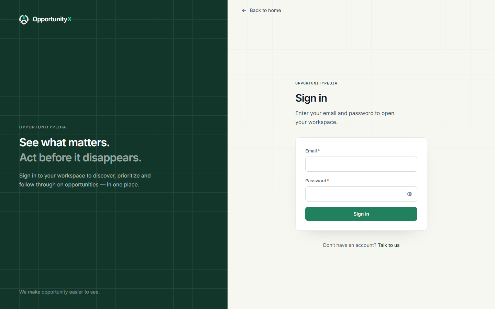
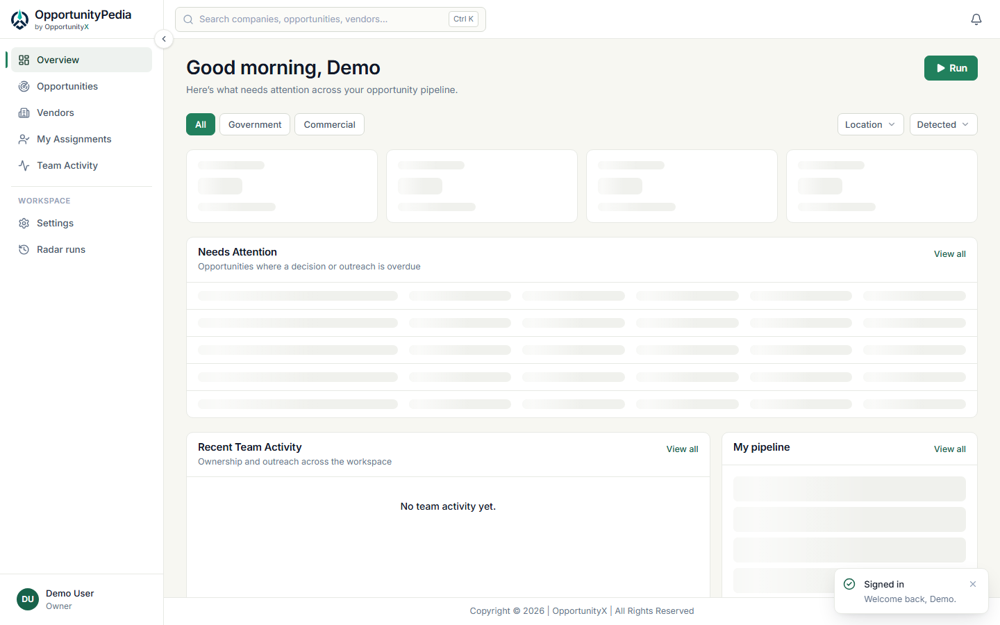
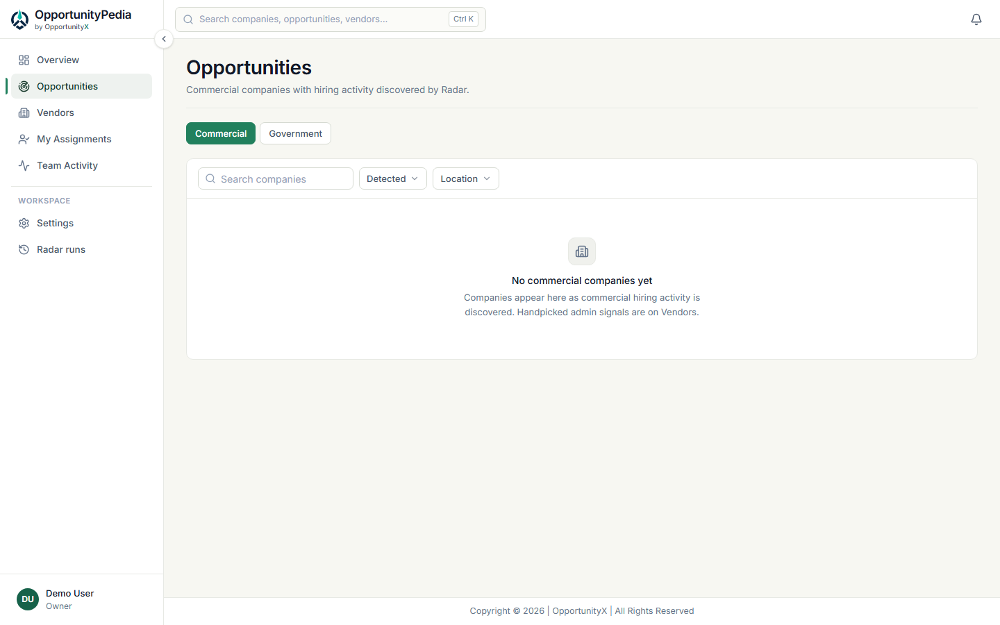
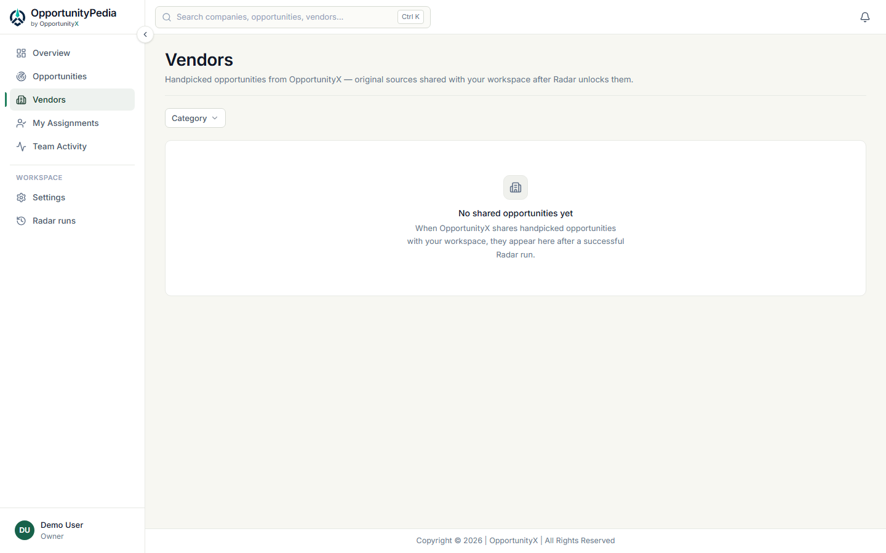
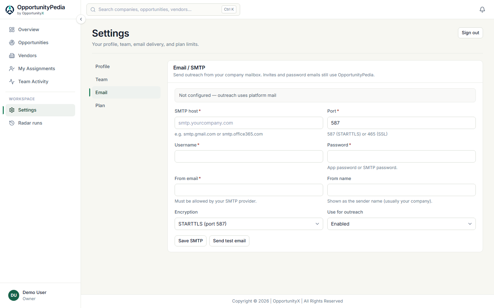

# OpportunityPedia — Quick Start Guide

A short tour of the product: what it is, why it helps, and how to use it after you sign in.

---

## What is OpportunityPedia?

**OpportunityPedia** (by **OpportunityX**) helps staffing and business development teams find hiring signals and government opportunities **in one place** — then prioritize and act together.

---

## The problem

Today, teams often:

- Check many sites by hand  
- Share leads in chats or spreadsheets  
- Miss follow-ups  

OpportunityPedia turns that into one clear workspace.

---

## What you get

1. **Scan** with Radar (one click)  
2. **See** commercial and government opportunities together  
3. **Focus** on what’s **Hot** / **Very Hot**  
4. **Assign**, outreach, and track as a team  
5. **Unlock** handpicked Vendor leads after a successful scan  

---

## Your first session

### 1. Sign in

Open the login page with your account. You land on **Overview**.

### 2. Run Radar

On **Overview**, click **Run**. Wait until the scan finishes.

> If **Run** is unavailable, wait for the cooldown or check **Radar runs**.

### 3. Browse Opportunities

Open **Opportunities** in the sidebar.

- **Commercial** — company hiring activity  
- **Government** — public-sector / contract-style signals  

Click a row for details, assign, or send outreach.

### 4. Check Vendors

Open **Vendors** for handpicked opportunities shared with your workspace. They appear after a **successful Radar run**.

### 5. Work as a team

- **My Assignments** — your queue  
- **Team Activity** — what the team did  
- Outreach — send email (AI draft available when enabled)  

### 6. Company email (owners)

**Settings → Email** — add your company SMTP so outreach sends from your mailbox.

Invites and password emails still use the platform mail.

---

## Quick map

| Page | Purpose |
|---|---|
| **Overview** | Dashboard + **Run** |
| **Opportunities** | What Radar found |
| **Vendors** | Shared / handpicked leads |
| **My Assignments** | Your work |
| **Team Activity** | Team follow-ups |
| **Settings** | Profile, team, email, plan |
| **Radar runs** | Scan history |

---

## Simple meanings

- **Hot / Very Hot** — priority signals (act on Very Hot first)  
- **Commercial** — private-sector hiring  
- **Government** — public / contract-style  
- **Radar** — the scan that refreshes your data  
- **Vendors** — curated leads for your workspace (not a vendor marketplace)  

---

## Daily rhythm

1. Overview → **Run** (when available)  
2. Check Opportunities  
3. Check Vendors  
4. Work My Assignments  
5. Glance at Team Activity  

---

## Need help?

Profile menu (bottom of the sidebar) → **Help & Support**, or use the website **Contact** page.

*OpportunityPedia by OpportunityX — find the signal, act together.*
